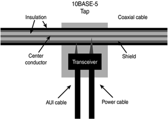
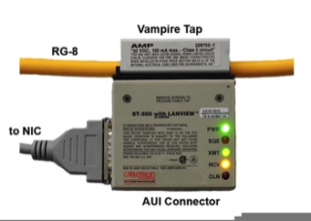
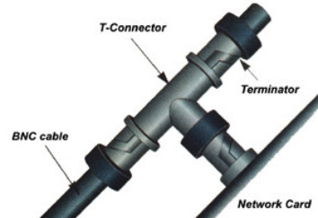
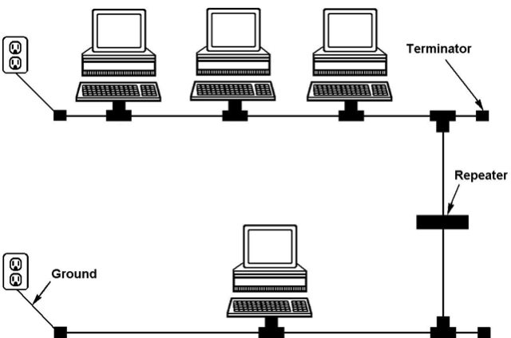
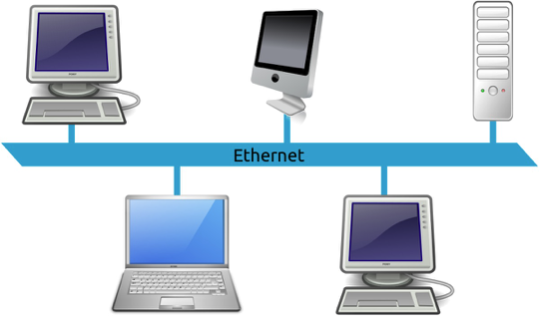
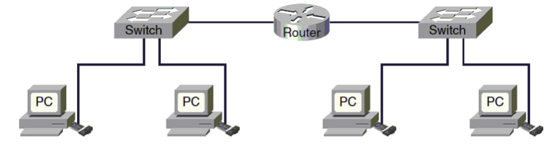

name: main

### .aim[CSTopics: Networking]

---
template: main

#### Layer Models of Networking

Due to the complexity of network communications, the topic is often conceptualized into distinct layers so people can work on specific components rather than everything at once.

--

The bottom layer is the most concrete, with each subsequent layer becoming more abstract (relying less on the physical connections and more on code).

--

There are various competing models, including the OSI (Open Systems Interconnections) and TCP/IP Models.

--

TCP/IP Model Layers
1. Application
2. Transport
3. Internet
4. Link

---
template: main

#### Link Layer

Point-to-point transmission between devices on the same (local) network.

--

Combines physically connecting computers with basic addressing and transmission protocols.

--

Physical connection

* How to transmit bits between two computers.

--

* Electrons, photons, radio waves…

---
template: main

#### Link Layer: A brief history of physical connections

__Thicknet__

A single coaxial cable runs along the network.

“Vampire taps” cut into the cable and connect to a computer.

 

---
template: main

__Thinnet__

A single coaxial cable runs along the network.

T-Connectors connect computers to the main cable.

.center[]

---
template: main

__Thin/Thicknet network topology__

.center[]

???
Each new computer degrades the network
collisions could cause issues

---
template: main

__Token Ring__

Each computer is connected in a ring to each other.

Only one computer has command of network resources at a time. This is called "having the token”.

The network sends a "token" throughout the ring, which contains the identity of the computer allowed to use the network. All other computers must wait to send data over the network.

.center[]

???
Each computer provides its own power and keeps single strength constant.

No possibility of collisions

---
template: main

__Ethernet__

Multiple computers connect to a single hub or switch.

Hub: Broadcasts the data to all the computers

Switch: Sends data to a specific computer

.center[]

---
template: main

#### Link Layer: The Softer Side

In order for data to be sent between computers:

--

* Each computer needs a unique address (MAC Address).
* The data needs to be sent in a standardized format (Frames).

--

__MAC (Media Access Control) Address__

* 6 - Byte Hex address: `2a:00:1e:b9:70:f6`
* MAC addresses only need to be unique on the same local network.

---
template: main

#### Link Layer: The Softer Side

__Ethernet Frames__

Each frame has the following format:

`prefix` `dest` `source` `type` `data` `checksum`

`prefix` 8B: `10101010` x7 + `10101011`

`dest` & `source` 6B each: MAC addresses

`type` 2B

`data`: MTU (Maximum Transmission Unit) of 1500B

`checksum` 4B: ensures data integrity

???
<table style="border: solid 1px black">
<thead>
<tr>
<th>prefix</th><th>dest</th>
</tr>
</thead>
</table>

prefix | dest | source | type | data | checksum
--|--|--|--|--
8B  |   6B  |  6B  |  2B |  4B

---
template: main

#### Internet Layer

Transmission of data between two separate networks.

Major features of this layer are addressing and routing.

Routers are physical devices used to connect different local networks.

Internet layer traffic ignores the specifics of link layer traffic.

Inernet Protocol (IP) covers the standards for addressing and packet format.

---
template: main

__Routing__

Routers break IPv4 packets (more later) into fragments.

When a router receives a packet, it has 2 options:

  1. Send that packet to the attached local network.
  2. Forward that packet to a different router.

Routers have address tables that identify all connected networks/devices.

---
template: main

__IP Packets__

IPv4 Packet format:

`header` `source` `destination` `data`

--

`header` 12B: Packet metadata

`source` and `destination` 4B each: IP Address

`data`: MTU is 65,535 Bytes

???
IPv6 uses 8 Byte addresses
IPv6 allows for jumbograms, with an MTU of 4GB

---
template: main

__IPv4 packet header__

`type` `size` `fragment info` `ttl` `protocol` `header checksum`

 

--

`type` 2B: IPv4 / v6, length of header

`size` 2B: Total size of the packet

`fragment info` 4B: full payloads may be broken into multiple fragments. Each packet will count the number of fragments and its individual fragment number.

`ttl` (time-to-live) 1B: Maximum number of hops a packet can make before reaching its destination.

`protocol` 1B: TCP / UDP (this is transport layer information)

`header checksum` 2B: only a checksum of the header, not the full packet.

---
template: main

__IP Addressess__

Every device connected to the internet has an I.P. (Internet Protocol) address.

They might look like this: `149.89.150.100`  (IPv4)

or this: `0:0:0:0:0:ffff:9559:9664` (IPv6)

IP addresses are only needed when connected.

For the most part, organizations own blocks of IP addresses, and give them to their users as needed.

Because IP addresses are released in blocks, internet traffic can be routed in an efficient manner.

---
template: main

__IPv4 / IPv6 differences__

Address space: 2^32 / 2^128

Packet format: In addition to address size change, IPv6 packet headers have less information. They do not include a checksum or fragment information.

MTU:  IPv6 can allot for an MTU of 2^32 (these are called jumbograms)

IPv6 puts more work onto Link layer devices and individual hosts (computers)

IPv6 does not fragment packets at all, relying on other devices to potentially take advantage of jumbograms

IPv6 has no checksum, assuming Link layer devices and hosts will check for data integrity if needed.

---
template: main

#### Transport Layer

Computer to computer connection over a network.

Unconcerned with the individual hops of internet layer traffic.

In a program, a _socket_ is the data type associated with a transport layer connection.

Network ports are used at the transport layer that allow a computer to have multiple open network connections at the same time.

TCP and UDP are transport layer protocols.

---
template: main

#### Netowrk Ports

A network port is a computer specific sub-address that allows computers (that have a single IP address) to have multiple open netowkr connections.

There are [65,536 ports](https://en.wikipedia.org/wiki/List_of_TCP_and_UDP_port_numbers).

Ports < 1024 are well known, reserved ports used for specific services.

* For example, an ssh server will have an open socket on port 22 (this is similar to a WKP). When a child process is created to communicate with a client, that process uses a different port, leaving 22 open for the listening server.

Regulated by the Internet Assigned Numbers Authority (IANA)

---
template: main

__Transmission Control Protocol (TCP)__

* Reliable connection, guarantees delivery of data.

* Data is considered a continuous stream that arrives in the order it is sent (which may not be true in the lower layers)

* Connections are established using a 3-way handshake

__User Datagram Protocol (UDP)__

* Does not require an explicit connection, no gaurantee of data delivery (at the transport layer).

* Data is sent as discrete datagrams with a set size (as opposed to a continuous stream).

* Datagrams may be dropped, or received out of order.

* UDP connections are faster because they do not need to be reassembled at the other end.

* Error checking can still be handled at an upper level.

---
template: main

#### Data Encapsulation

As data crosses from an upper layer to a lower one, layer-specific metadata is added to help aid transmission.

Application —> Transport
* UDP or TCP headers are added, including network port information

Transport —> Internet
* Data (including Transport headers) is packaged into IP Packets.

Internet —> Link
* Packets (including IP and Transport headers) are packaged into Ethernet Frames.

???
Data decapsulation
When data crosses back up a layer, the packaging for the lower layer is removed.
